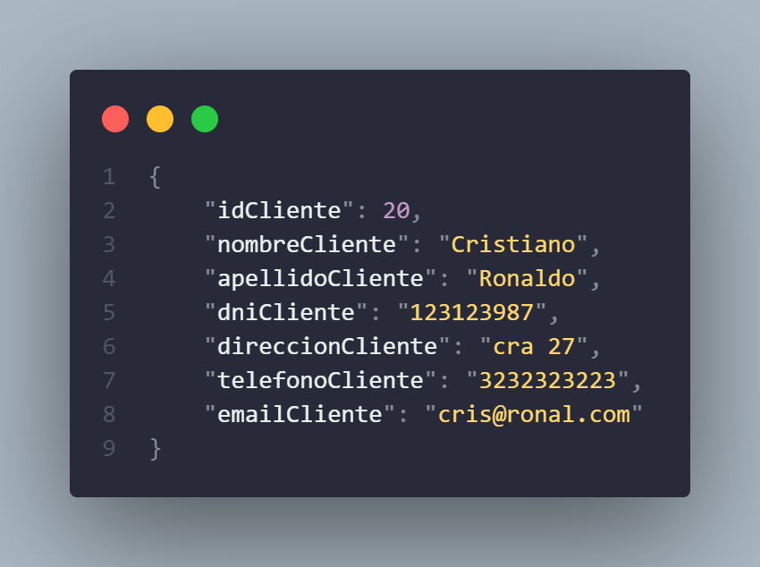

# Sistema de Gestion de Alquiler de Autos

se desarrolla el back-end de un aplicativo web utilizando Node.js y Express. Se utiliza una base de datos NoSql, para este caso MongoDB. Se almacena toda la informacion relacionada con los clientes, automóviles, alquileres, reservas,
sucursales y empleados.

se implementa un sistema de autenticación basado en JWT (JSON Web Tokens) para garantizar la seguridad de la información.

## Requisitos del sistema

- Node.js y NPM (Node Package Manager) instalados en el sistema.
- Mongodb instalado

## Dependencias del Proyecto

Las dependencias que se utilizan en este proyecto son las siguientes:
```Json
    "dependencies": {
        "express": "^4.18.2"
    },
    "devDependencies": {
        "class-transformer": "^0.5.1",
        "class-validator": "^0.14.0",
        "dotenv": "^16.3.1",
        "express-rate-limit": "^6.9.0",
        "jose": "^4.14.4",
        "mongodb": "^5.7.0",
        "nodemon": "^3.0.1",
        "reflect-metadata": "^0.1.13",
        "typescript": "^5.1.6"
    }
```

## Instalacion

1. Clona este repositorio:
    ```bash
    https://github.com/dVera17/APIMongoAlquilerAutos.git
    ```
2. Instala las dependencias con el comando:
    ```bash
    npm install
    ```
3. Crea un archivo .env y copia las variables de entorno del archivo .env.example y colocar sus valores, ejemplo:
    ```Javascript
    // .env
    JWT_PRIVATE_KEY ="tu clave secreta para json web token"
    PORT_SERVER = 5010
    DB_HOST = 'host de la base de datos. example: localhost'
    ATLAS_USER = 'tu usuario'
    ATLAS_PASSWORD = 'tu password'
    ATLAS_DB = 'el nombre de la base de datos'
    ```

## Configuracion del packge.json

Las importaciones se manejaran con el estandar ES6 y se agrega el comando "dev" si se esta utilizando [nodemon](https://www.npmjs.com/package/nodemon).
```json
{
    ...,
    "type": "module",
    "scripts": {
        "tsc": "tsc -w",
        "dev": "nodemon --quiet src/index.js"
    }
    ...,
}
```

## Seguridad y autenticacion

Este proyecto implementa un sistema de autenticación basado en JWT (JSON Web Token) para proteger los endpoints y garantizar un acceso seguro a la API. JWT es un estándar ampliamente utilizado para la autenticación y autorización en aplicaciones web modernas. Por el momento se utiliza un unico token de acceso publico para la autorización.

### Autenticación con JWT

Para obtener un token con acceso al API tienes dos opciones:

1. `GET /token/:table`
    - Descripción: Este endpoint va a generar un JWT para una tabla especifica, en este caso (`Cliente`).
    - De esta forma: `localhost:5010/token/cliente`
    - Nota: asegurate de que la url este bien escrita. Solo copia y pega.

2. `GET /token/generate/:global`
    - Descripción: Este endpoint va a generar un JWT global para que puedas acceder a las demas tablas del API.
    - De esta forma: `localhost:5010/token/generate/global`
    - Nota: asegurate de que la url este bien escrita. Solo copia y pega.

de esta forma el servidor generará un token firmado que contendrá esta información y se lo devolvera al cliente en la respuesta.

### Manejo de Tokens Expirados

Para garantizar la seguridad, los tokens JWT tienen una tiempo de expiración, en este caso tienes una hora. Una vez que un token ha expirado, el cliente debe obtener un nuevo token al autenticarse nuevamente en la API.

### Requisitos para la Generación de Tokens

Los tokens JWT generados por la aplicación utilizan el algoritmo de firma "HS256" (HMAC con SHA-256) para garantizar la integridad del token. La longitud del token y otros detalles de configuración se han establecido siguiendo las mejores prácticas de seguridad.

Para obtener más información sobre JWT, te recomendamos revisar el siguiente recurso:
- [JSON Web Token (JWT) Introduction](https://jwt.io/introduction/)

## Descripción de Endpoints

### Alquiler

1. `GET /api/alquiler`
    - Descripción: .Obtener la cantidad total de alquileres registrados en la base de datos. 

2. `GET api/alquiler/estado/activo`
    - Descripción: Listar todos los alquileres activos junto con los datos de los clientes relacionados.

3. `GET /api/alquiler/:id`
    - Descripción: Obtener los detalles del alquiler con un id específico

4. `GET /api/alquiler/costo_total/:id`
    - Descripción: Obtener el costo total de un alquiler específico.

5. `GET /api/alquiler/fecha/inicio`
    - Descripción: Obtener los detalles del alquiler que tiene fecha de inicio en '2023-07-05'

6. `GET /api/alquiler/fecha/rango`
    - Descripción: Listar los alquileres con fecha de inicio entre '2023-07-05' y '2023-07-10'.

### Automovil

1. `GET /api/automovil/disponibles`
    - Descripción: Obtener todos los automóviles disponibles para alquiler.

2. `GET /api/automovil/capacidad`
    - Descripción: Mostrar todos los automóviles con una capacidad mayor a 5 personas.

3. `GET /api/automovil/ordenados`
    - Descripción: Listar todos los automóviles ordenados por marca y modelo.

4. `GET /api/automovil/capacidadydisponibilidad`
    - Descripción: Mostrar los automóviles con capacidad igual a 5 personas y que estén disponibles

### Cliente

1. `GET /api/cliente`
    - Descripción: Mostrar todos los clientes registrados en la base de datos.

2. `GET /api/cliente/:dni`
    - Descripción: Listar los clientes con el DNI específico. 

3. `GET /api/cliente/alquiler/minimo`
    - Descripción: Obtener los datos de los clientes que realizaron al menos un alquiler. 

4. `GET /api/cliente/reserva/:id_reserva`
    - Descripción: Obtener los datos del cliente que realizó la reserva con id de la reserva especifico.

5. `POST /api/cliente`
    - Descripción: Agrega un cliente nuevo a la base de datos.

    Este es un ejemplo de como debe ir el json que se envía en el body:

[](imgs/exampleJsonBody.png)

### Empleado

1. `GET /api/empleado/cargo/:cargo`
    - Descripción: Mostrar los empleados con cargo de "Gerente" o "Asistente" o "Vendedor"
    - Nota: Recuerda colocar correctamente el cargo en los parametros de la url

### Reserva

1. `GET /api/reserva/estado/pendiente`
    - Descripción: Mostrar todas las reservas pendientes con los datos del cliente y el automóvil reservado. 

2. `GET /api/reserva/:dni`
    - Descripción: Listar las reservas pendientes realizadas por un cliente específico. 

### Sucursal

1. `GET /api/sucursal/autos_disponibles`
    - Descripción: Mostrar la cantidad total de automóviles en cada sucursal junto con su dirección.

## Inicialización del servidor

Para empezar a utilizar la aplicación, abre tu terminal y ejecuta el siguiente comando.
```bash
npm run dev
```